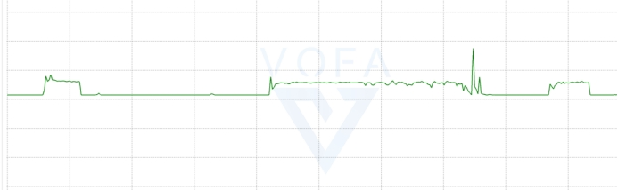
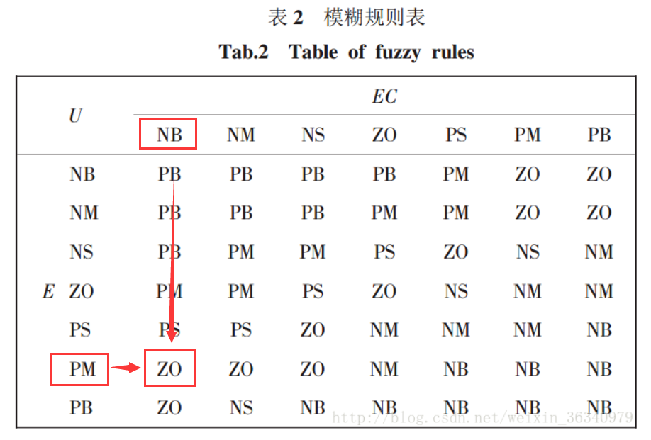
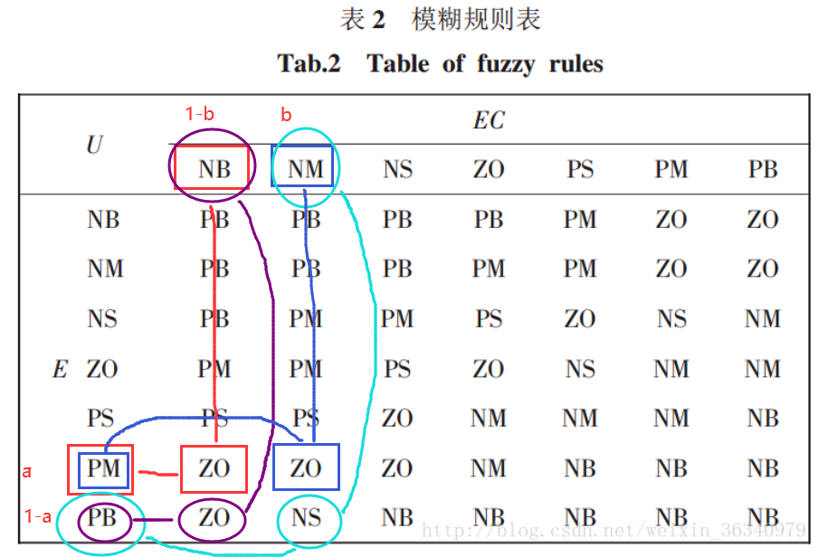
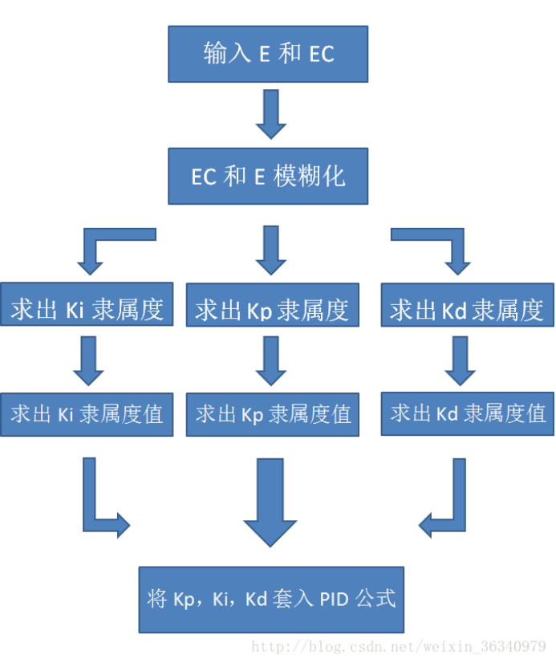

# 2022国赛步兵组代码开源

## 介绍

  步兵电控以FreeRTOS作为系统调度，整体实现分为UI界面、底盘控制、数据传输，分别对应不同的Task实现。


## 亮点

+ **UI界面传输**：充分利用了裁判系统通信带宽，分时发送各个字符和数据，最小限度占用cpu

+ **底盘功率控制**：保持较高的平均功率，最大化利用剩余能量

+ **云台双轴模糊pid**：配合步兵机械的重力补偿云台，响应迅速、稳定

+ **前馈控制**：底盘跟随由原先的pid跟随更换为前馈控制，跟随更迅速

+ **掉线检测**：对所有硬件部分与连接部分做掉线检测


## 底盘功率思路

本战队步兵组功率限制算法主要基于的核心思想，就是前馈和反馈结合的控制。

其中先通过前馈预测，得出本次底盘电机控制期望的功率，即先通过数理知识及测量获得电调反馈的转速，再根据每次PID运算得出的期望转矩电流，相乘求和，再乘上一个比例系数，就可以得出本次的期望功率。如果超出预期的话，则对期望速度进行削减（不能削减控制电流，因为二者并非线性关系）。

当然，仅仅是前馈控制不能保证如此完美的功率控制，反馈控制也起着很重要的作用，根据裁判系统实时反馈的功率数据，再实测功率不同的情况下，将不同功率下对应的数值映射到不同的功率参数上，并且在缓存能量低于一定阈值后为了安全提高限制功率力度。

良好的前反馈结合再加上前端输入的期望速度比较合理的情况下，便可达到相当完美的功率控制。

并且实际实验也和预期的一样：（如下）

测量得到电机的控制力矩电流与电机实际转速乘积与电机的实际功率的线性系数.（如下图所示，经实际测量采集数据实际此线性关系近似成立）

 


## 双轴模糊pid部署以及调参

### 部署步骤

​	首先我们的采集到云台的相关数据，例如IMU，其采集到的数据经过算法处理之后会得到云台当前位置的偏差$E$，以及当前偏差和上次偏差的变化（差值）$EC$两个值

​	接着我们要对这两个值进行模糊化。我现在将E的区间（-1.2 到 1.2）分成6个部分，那么他们分别为-1.2 ~ -0.8，-0.8 ~ -0.4 ，-0.4 ~ 0，0 ~ 0.4，0.4 ~ 0.8，0.8 ~ 1.2。然后我们把-1.2，-0.8，-0.4，0，0.4，0.8，1.2分别用$NB，NM，NS，ZO，PS，PM，PB$表示（个人理解$N$为negative，$P$为positive，$B$为big，$M$为middle，$S$为small，$ZO$为zero）。例如，当$E = 0.9$时，此时的$E$属于和之间，而此时的$E$也会对应2（或1）个隶属度。$E$隶属于$PM（0.9）$的百分比为$$(1.2 – 0.9)/(1.2-0.8) = 3/4$$ ，而同理隶属于$PB（0.9）$的百分比为$$(0.9 – 0.8)/(1.2-0.8) = 1/4$$  。意思就是0.8到1.2进行线性分割了，$E$离$PM$和$PB$哪个更近，则隶属于哪个就更大（当输出值$E$大于$1.2（PB）$时，则隶属度为1，隶属度值为$PB$，即$E$完全隶属于$PB$，同理当$E$小于 $– 1.2(NB)$时也一样）。同理也可以对$EC$进行模糊化。

 **模糊推理**

​	对于采集回来的$E$和$EC$，我们可以推出它们各所占的隶属度，此时我们可以根据模糊规则表去找出输出值所对应的隶属度。

 

​	同理我们可以得出，当输出值属于$ZO$的另外两个隶属度为 $$a\times b, (1-a)\times(1-b)$$ ，而输出值属于$NS$的隶属度为$$(1-a)\times(1-b)$$。

​	在这里我们先证明一个条件，将这四个隶属度加起来，刚好等于1。这是因为

$$
(a+(1-a))\times (b+(1-b))=a\times b + (1-a)\times b + a \times (1-b) + (1-a) \times (1-b)
$$
即一个十字相乘的概念。这个等式说明输出值的隶属度之和等于1（第三步求解的时候需要用到隶属度之和）。



因此，我们知道了输出值为$ZO$的隶属度和为 $$a \times b + a \times ( 1 - b ) + ( 1 - a ) \times ( 1 - b )$$ ，输出值为$NS$的隶属度为 $$( 1 - a ) \times b$$ 。

**清晰化**

​	对于输出值，我们同样采用给予隶属度的办法。例如，我们把输出值假设为$[-0.3，0.3]$（即$kp$的上下浮动范围）的区间同样划分为六个部分，即7个隶属值$NB, NM, NS, ZO, PS, PM, PB$根据上一步所得出的结论，我们就可以用隶属度乘以相应的隶属值算出输出值的解，即 
$$
a \times b + a \times ( 1 - b ) + ( 1 - a ) \times ( 1 - b ) ) \times ZO  +   ( 1 - a ) \times  b \times NS
$$
到此为止，整个模糊过程就结束了。

**模糊PID**

​	我们已经知道了整个模糊的过程，但上述的过程还不够完美。因为我们的输出值只有一个输出，并没有实现PID。因此我们可以先对$E$和$EC$进行模糊化，然后分别对$kp$和$ki$和$kd$（PID的三个参数）进行求解，再套入公式。



​	一般的我们也可以只用$kp，kd，$不用$ki$。而模糊规则表一般的论文已经基本给出。因此带入算法之后我们的难度也只是在于调节$kp，kd，$和适当调节规则表。当然调节的难度会大于普通的PID，因为还要定$kp，kd$的输出范围，调得不好可能效果并没有普通的PID好。


### 代码实现

```c
/*********模糊pid部分*/

#define NL   -3
#define NM	 -2
#define NS	 -1
#define ZE	 0
#define PS	 1
#define PM	 2
#define PL	 3
 
static const float fuzzyRuleKp[7][7]={
	PL,	PL,	PM,	PM,	PS,	ZE,	ZE,
	PL,	PL,	PM,	PS,	PS,	ZE,	NS,
	PM,	PM,	PM,	PS,	ZE,	NS,	NS,
	PM,	PM,	PS,	ZE,	NS,	NM,	NM,
	PS,	PS,	ZE,	NS,	NS,	NM,	NM,
	PS,	ZE,	NS,	NM,	NM,	NM,	NL,
	ZE,	ZE,	NM,	NM,	NM,	NL,	NL
};
 
static const float fuzzyRuleKi[7][7]={
	NL,	NL,	NM,	NM,	NS,	ZE,	ZE,
	NL,	NL,	NM,	NS,	NS,	ZE,	ZE,
	NL,	NM,	NS,	NS,	ZE,	PS,	PS,
	NM,	NM,	NS,	ZE,	PS,	PM,	PM,
	NS,	NS,	ZE,	PS,	PS,	PM,	PL,
	ZE,	ZE,	PS,	PS,	PM,	PL,	PL,
	ZE,	ZE,	PS,	PM,	PM,	PL,	PL
};
 
static const float fuzzyRuleKd[7][7]={
	PS,	NS,	NL,	NL,	NL,	NM,	PS,
	PS,	NS,	NL,	NM,	NM,	NS,	ZE,
	ZE,	NS,	NM,	NM,	NS,	NS,	ZE,
	ZE,	NS,	NS,	NS,	NS,	NS,	ZE,
	ZE,	ZE,	ZE,	ZE,	ZE,	ZE,	ZE,
	PL,	NS,	PS,	PS,	PS,	PS,	PL,
	PL,	PM,	PM,	PM,	PS,	PS,	PL
};
 

 //关键算法
void fuzzy( FuzzyPID*  fuzzy_PID)
{
     float e = fuzzy_PID ->PreError/ fuzzy_PID->stair;
     float ec = (fuzzy_PID ->Out - fuzzy_PID ->Out_last) / fuzzy_PID->stair;
     short etemp,ectemp;
     float eLefttemp,ecLefttemp;    //隶属度
     float eRighttemp ,ecRighttemp; 
 
     short eLeftIndex,ecLeftIndex;  //标签
     short eRightIndex,ecRightIndex;

    //模糊化
    if(e>=PL)
        etemp=PL;//超出范围
    else if(e>=PM)
        etemp=PM;
    else if(e>=PS)
        etemp=PS;
    else if(e>=ZE)
        etemp=ZE;
    else if(e>=NS)
        etemp=NS;
    else if(e>=NM)
        etemp=NM;
    else if(e>=NL)
        etemp=NL;
    else 
        etemp=2*NL;

    if( etemp == PL)
		{
		 //计算E隶属度
				eRighttemp= 0 ;    //右溢出
				eLefttemp= 1 ;
			
     //计算标签
	   eLeftIndex = 6 ;      
	   eRightIndex= 6 ;
			
		}else if( etemp == 2*NL )
    {

			//计算E隶属度
				eRighttemp = 1;    //左溢出
				eLefttemp = 0;
	
     //计算标签
	   eLeftIndex = 0 ;       
	   eRightIndex = 0 ;
			
		}	else 
    {

			//计算E隶属度
				eRighttemp=(e-etemp);  //线性函数作为隶属函数
				eLefttemp=(1- eRighttemp);
			
     //计算标签
	   eLeftIndex =(short) (etemp-NL); //例如 etemp=2.5，NL=-3，那么得到的序列号为5  【0 1 2 3 4 5 6】
	   eRightIndex=(short) (eLeftIndex+1);
			
     }		
	   
		
    if(ec>=PL)
        ectemp=PL;
    else if(ec>=PM)
        ectemp=PM;
    else if(ec>=PS)
        ectemp=PS;
    else if(ec>=ZE)
        ectemp=ZE;
    else if(ec>=NS)
        ectemp=NS;
    else if(ec>=NM)
        ectemp=NM;
    else if(ec>=NL)
        ectemp=NL;
    else 
        ectemp=2*NL;
		 
	  
    if( ectemp == PL )
    {
        //计算EC隶属度		 
        ecRighttemp= 0 ;      //右溢出
        ecLefttemp= 1 ;

        ecLeftIndex = 6 ;  
        ecRightIndex = 6 ;	 

    } 
    else if( ectemp == 2*NL)
    {
        //计算EC隶属度		 
        ecRighttemp= 1 ;
        ecLefttemp= 0 ;

        ecLeftIndex = 0 ;  
        ecRightIndex = 0 ;	 	 
    }
    else
    {
        //计算EC隶属度		 
        ecRighttemp=(ec-ectemp);
        ecLefttemp=(1- ecRighttemp);

        ecLeftIndex =(short) (ectemp-NL);  
        ecRightIndex= (short)(eLeftIndex+1);
    }	

 
/*************************************反模糊*************************************/
 
 
 
 
	fuzzy_PID->dKp = fuzzy_PID->Kp_stair * (eLefttemp * ecLefttemp * fuzzyRuleKp[eLeftIndex][ecLeftIndex]                   
   + eLefttemp * ecRighttemp * fuzzyRuleKp[eLeftIndex][ecRightIndex]
   + eRighttemp * ecLefttemp * fuzzyRuleKp[eRightIndex][ecLeftIndex]
   + eRighttemp * ecRighttemp * fuzzyRuleKp[eRightIndex][ecRightIndex]);
 
	fuzzy_PID->dKi = fuzzy_PID->Ki_stair * (eLefttemp * ecLefttemp * fuzzyRuleKi[eLeftIndex][ecLeftIndex]
   + eLefttemp * ecRighttemp * fuzzyRuleKi[eLeftIndex][ecRightIndex]
   + eRighttemp * ecLefttemp * fuzzyRuleKi[eRightIndex][ecLeftIndex]
   + eRighttemp * ecRighttemp * fuzzyRuleKi[eRightIndex][ecRightIndex]);

 
	fuzzy_PID->dKd = fuzzy_PID->Kd_stair * (eLefttemp * ecLefttemp * fuzzyRuleKd[eLeftIndex][ecLeftIndex]
   + eLefttemp * ecRighttemp * fuzzyRuleKd[eLeftIndex][ecRightIndex]
   + eRighttemp * ecLefttemp * fuzzyRuleKd[eRightIndex][ecLeftIndex]
   + eRighttemp * ecRighttemp * fuzzyRuleKd[eRightIndex][ecRightIndex]);
 
}


float FuzzyPID_Calc(FuzzyPID *P)
{
	
    P->LastError = P->PreError;

    if((ABS(P->PreError)< P->DeadZone ))   //死区控制
    {
        P->PreError = 0.0f;			
    }
    else
    {
        P->PreError = P->SetPoint - P->ActualValue;
    }

    fuzzy(P);      //模糊调整  kp,ki,kd   形参1当前误差，形参2前后误差的差值
	
    float Kp = P->Kp0 + P->dKp , Ki = P->Ki0 + P->dKi , Kd = P->Kd0 + P->dKd ;   //PID均模糊
//	float Kp = P->Kp0 + P->dKp , Ki = P->Ki0  , Kd = P->Kd0 + P->dKd ;           //仅PD均模糊
//	float Kp = P->Kp0 + P->dKp , Ki = P->Ki0  , Kd = P->Kd0 ;                    //仅P均模糊

		
		
    //微分先行
    float DM = Kd*(P->Out - P->Out_last);
    //变速积分
    if(ABS(P->PreError) < P->I_L )			
    {
	       //梯形积分
		P->SumError += (P->PreError+P->LastError)/2;    
		P->SumError = LIMIT_MAX_MIN(P->SumError,P->IMax,- P->IMax);
    }
    else if( ABS(P->PreError) < P->I_U )
    {
	       //梯形积分
		P->SumError += (P->PreError+P->LastError)/2*(P->PreError - P->I_L)/(P->I_U - P->I_L);    
		P->SumError = LIMIT_MAX_MIN(P->SumError,P->IMax,- P->IMax);		
    }
			
    P->POut = Kp * P->PreError;

    P->IOut = Ki * P->SumError;

    //不完全微分
    P->DOut_last = P->DOut; 
    P->DOut = DM * P->RC_DF + P->DOut_last * ( 1 - P->RC_DF );    

    P->Out_last  = P->Out;
    P->Out = LIMIT_MAX_MIN(P->POut+P->IOut+P->DOut,P->OutMax,-P->OutMax);
		
    return P->Out;                             

}
```


### 调试经验

  先调速度环后调位置环，先P后I再D。如果模糊梯度给的比较小，就是普通双环pid的整定方式了，但是由于具备模糊区间，所以具有更好的鲁棒性，很可能会过于敏感，很容易失稳，需要权衡。

   如果一直小范围低频摆动是位置环i给大了，高频振动是$kp$给大了，也可能是$kd$，$ki$要给到消除静差，主要起影响作用的是速度环，我们需要精调速度环的$pi$，位置环不需要特别精细。
